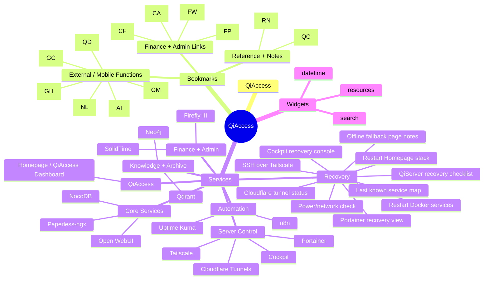

# QiAccess Config Map

- Title: `QiAccess`
- Bookmark groups: `3`
- Bookmarks: `12`
- Service groups: `7`
- Services: `24`
- Widgets: `3`

## Bookmark Groups

### External / Mobile Functions

- `ChatGPT` -> `https://chatgpt.com/` - Operator assistant surface
- `GitHub` -> `https://github.com/` - Code, repos, and issues
- `Gmail` -> `https://mail.google.com/` - Mail and intake
- `Google Calendar` -> `https://calendar.google.com/` - Scheduling and calendar control
- `Google Drive / QiNexus` -> `https://drive.google.com/` - QiNexus workspace placeholder
- `NotebookLM` -> `https://notebooklm.google.com/` - Research and note synthesis

### Finance + Admin Links

- `Care/admin links` -> `https://care.placeholder.qially/` - Care and admin launch links placeholder
- `Cloudflare Dashboard` -> `https://dash.cloudflare.com/` - DNS, tunnels, and edge control
- `Family Wall` -> `https://familywall.placeholder/` - Shared family coordination placeholder
- `Finance portals` -> `https://finance.placeholder.qially/` - External financial account access placeholder

### Reference + Notes

- `Documentation / QiCore` -> `https://docs.placeholder.qially.internal/` - QiCore and system doctrine placeholder
- `Recovery notes` -> `https://docs.placeholder.qially.internal/recovery/` - Offline and recovery reference notes

## Service Groups

### Automation

- `n8n` -> `https://n8n.placeholder.qially.internal/` - Workflow automation and background orchestration
- `Uptime Kuma` -> `https://uptime.placeholder.qially.internal/` - Service status and monitoring status page

### Core Services

- `NocoDB` -> `https://nocodb.placeholder.qially.internal/` - Spreadsheet-style operational data entry
- `Open WebUI` -> `https://openwebui.placeholder.qially.internal/` - Local AI chat and tooling surface
- `Paperless-ngx` -> `https://paperless.placeholder.qially.internal/` - Document intake, OCR, and archive workflow

### Finance + Admin

- `Firefly III` -> `https://firefly.placeholder.qially.internal/` - Personal finance review and ledger control
- `SolidTime` -> `https://solidtime.placeholder.qially.internal/` - Time tracking and planning surface

### Knowledge + Archive

- `Neo4j` -> `https://neo4j.placeholder.qially.internal/` - Graph database and relationship exploration
- `Qdrant` -> `https://qdrant.placeholder.qially.internal/` - Vector storage and retrieval backend

### QiAccess

- `Homepage / QiAccess Dashboard` -> `https://access.qially.com/` - Canonical Homepage-powered dashboard for the Qi ecosystem

### Recovery

- `Cloudflare tunnel status` -> `https://one.dash.cloudflare.com/` - Edge path check when dashboard access degrades
- `Cockpit recovery console` -> `https://cockpit.placeholder.qially.internal/` - Browser-based server triage console
- `Last known service map` -> `https://docs.placeholder.qially.internal/recovery/service-map` - Reference map for expected service paths and bindings
- `Offline fallback page notes` -> `https://docs.placeholder.qially.internal/recovery/offline-fallback` - Cloudflare should show a static fallback page when QiServer is down
- `Portainer recovery view` -> `https://portainer.placeholder.qially.internal/` - Stack/container restart and state inspection
- `Power/network check` -> `https://docs.placeholder.qially.internal/recovery/power-network` - Basic host, router, and connectivity check sequence
- `QiServer recovery checklist` -> `https://docs.placeholder.qially.internal/recovery/qiserver-checklist` - Manual checklist for origin-down response
- `Restart Docker services` -> `https://docs.placeholder.qially.internal/recovery/restart-docker` - Manual runbook placeholder, use terminal or Portainer for action
- `Restart Homepage stack` -> `https://docs.placeholder.qially.internal/recovery/restart-homepage` - Manual runbook placeholder, not an in-dashboard control
- `SSH over Tailscale` -> `ssh://qiserver-1.cerberus-sirius.ts.net` - Direct server shell access over the tailnet

### Server Control

- `Cloudflare Tunnels` -> `https://one.dash.cloudflare.com/` - Tunnel and edge path visibility
- `Cockpit` -> `https://cockpit.placeholder.qially.internal/` - System administration console for QiServer
- `Portainer` -> `https://portainer.placeholder.qially.internal/` - Container and stack operations
- `Tailscale` -> `https://login.tailscale.com/admin/machines` - Tailnet reachability and device access

## Widgets

- `datetime`
- `resources`
- `search`
