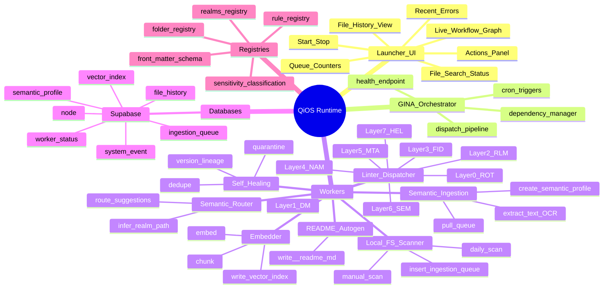

# Launcher UI Mind Map & Execution Flow

## Mermaid Mind Map



## Execution Order

### A. Manual or Daily Scan

1. **Local FS Scanner**
   - Obeys ignore list (`rules/fs_ignore.yaml`)
   - Computes SHA-256 hash of file bytes
   - UPSERT → `ingestion_queue` (status: `pending`)
   - Records event → `file_history` (event_type: `seen`, actor: `scanner`)

### B. Ingestion Batch (Cron)

2. **Semantic Ingestion Worker**
   - Pulls `pending` items from `ingestion_queue`
   - Marks status: `pending` → `in_progress`
   - Extracts text / OCR hook
   - UPSERT → `semantic_profile` (file-level stub)
   - Marks queue: `in_progress` → `complete` or `quarantined`
   - Records event → `file_history` (event_type: `embedded`, actor: `ingestion`)

3. **Embedder Worker**
   - Reads `semantic_profile.embedding_status = 'pending'`
   - Chunks content
   - Generates embeddings (vector)
   - Writes → `vector_index` (chunk-level records)
   - Sets `embedding_status = 'complete'`
   - Records event → `file_history` (event_type: `embedded`, actor: `embedder`)

4. **Semantic Router**
   - Uses vector similarity + rules
   - Proposes realm/subpath
   - Writes routing suggestion + confidence
   - Records event → `file_history` (event_type: `routed`, actor: `router`)

### C. Governance Sweep (Cron or Post-Route)

5. **Linter Dispatcher**
   - Executes layers in strict order:
     - Layer 0 (ROT): Root Integrity
     - Layer 1 (DM): Dark Matter Physics
     - Layer 2 (RLM): Realm Schema
     - Layer 3 (FID): File Identity
     - Layer 4 (NAM): Naming
     - Layer 5 (MTA): Metadata
     - Layer 6 (SEM): Semantic Routing
     - Layer 7 (HEL): Self-Healing
   - Records events → `file_history` (event_type: varies, actor: `linter`)

6. **Self-Healing**
   - Dedupe detection
   - Version lineage tracking
   - Quarantine invalid files
   - Records events → `file_history` (event_type: `deduped` | `quarantined`, actor: `heal`)

7. **README Autogen**
   - Ensures every canonical folder has `_readme.md`
   - Updates if schema/rules changed
   - Records events → `file_history` (event_type: `moved`, actor: `readme_autogen`)

## Status Model (UI Rendering)

### Worker Cards (from `worker_status`)

- **state**: `green` | `orange` | `red` | `gray`
- **last_heartbeat**: timestamp
- **queue_depth**: count of pending items
- **last_error_code**: error code (if any)
- **last_error_message**: human-readable error
- **meta.phase**: current processing phase
- **meta.last_processed**: last processed file_path

### Recent Errors Panel

Join: `worker_status.last_error_code` → `system_event.event_code`

Display:
- Human description
- Suggested fix
- Timestamp
- Worker ID
- File path (if applicable)

### File Status / History

From `file_history` table:

- **file_path**: QiOS-relative path
- **content_hash**: SHA-256 hash
- **event_type**: `seen` | `embedded` | `routed` | `renamed` | `moved` | `deduped` | `quarantined`
- **actor**: `scanner` | `ingestion` | `embedder` | `router` | `linter` | `heal` | `human`
- **meta**: event-specific JSON
- **created_at**: timestamp

**UI View**:
- Timeline per file (chronological)
- Diff links (future enhancement)
- Filter by event_type, actor, date range

## Launcher UI Components

### 1. Start/Stop Controls
- Start/stop GINA Orchestrator
- Pause/resume workers
- Emergency stop

### 2. Live Workflow Graph
- Visual DAG of worker dependencies
- Real-time status indicators
- Click to drill down

### 3. Queue Counters
- `ingestion_queue`: pending, in_progress, complete, quarantined
- Per-worker queue depths
- Processing rate (items/minute)

### 4. Recent Errors
- Last 50 errors across all workers
- Grouped by error code
- Actionable suggestions

### 5. File Search Status
- Search by file_path, content_hash, event_type
- Real-time filtering
- Link to file history

### 6. File History View
- Timeline per file
- Event details
- Actor attribution
- Metadata inspection

### 7. Actions Panel
- Manual scan trigger
- Force re-route
- Quarantine release
- Manual dedupe merge

## Database Queries for UI

### Worker Status
```sql
SELECT 
  worker_id,
  state,
  last_heartbeat,
  queue_depth,
  last_error_code,
  last_error_message,
  meta->>'phase' as phase,
  meta->>'last_processed' as last_processed
FROM worker_status
ORDER BY last_heartbeat DESC;
```

### Recent Errors
```sql
SELECT 
  ws.worker_id,
  ws.last_error_code,
  ws.last_error_message,
  se.human_description,
  se.suggested_fix,
  ws.last_error_at
FROM worker_status ws
LEFT JOIN system_event se ON ws.last_error_code = se.event_code
WHERE ws.last_error_code IS NOT NULL
ORDER BY ws.last_error_at DESC
LIMIT 50;
```

### File History Timeline
```sql
SELECT 
  file_path,
  content_hash,
  event_type,
  actor,
  meta,
  created_at
FROM file_history
WHERE file_path = $1
ORDER BY created_at DESC;
```

### Queue Status
```sql
SELECT 
  status,
  COUNT(*) as count
FROM ingestion_queue
GROUP BY status;
```

## Canon Check

✅ **Layer 0 Compliance**: Launcher UI is observability infrastructure  
✅ **Layer 1 Compliance**: UI reads from protected system tables  
✅ **Layer 6 Compliance**: Displays semantic routing status  
✅ **Relative Paths**: All file_paths are QiOS-relative (canon)  
✅ **SHA-256 Hashing**: Content hashing uses SHA-256 on file bytes  
✅ **Ignore List**: Scanner respects `rules/fs_ignore.yaml`

