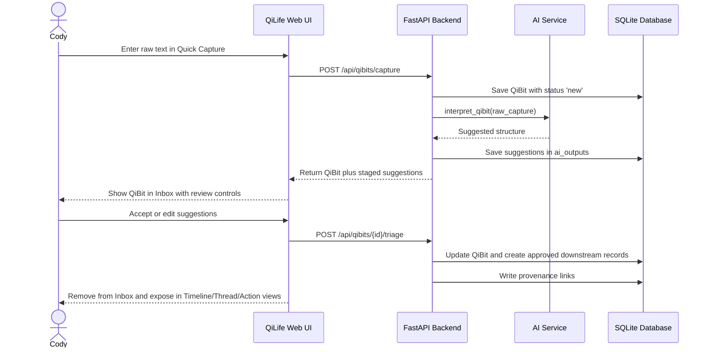

# QiLife User Flows

## 1. Quick Capture and AI Triage

## 2. Daily Planning

1. Cody opens **Today**.
2. QiLife shows:
   - due or scheduled actions
   - open loops (`waiting_on` actions and unresolved obligations)
   - recent QiBits
   - an AI focus summary placeholder or live summary
3. Cody schedules or reschedules actions by writing `scheduled_for`.
4. If an item is blocked, Cody sets the action or thread status to `waiting_on`.

## 3. Active Work with Context Dock

1. Cody opens a thread, action, QiBit, or person detail view.
2. The Context Dock shows:
   - linked knowledge items
   - linked documents
   - related QiBits
   - people/entities
   - obligations and transactions
   - prior resolutions and recent activity
3. Cody completes the work in the center pane while the Context Dock keeps the relevant knowledge beside it.

## 4. End-of-Day Review

1. Cody opens the end-of-day review in **Today**.
2. The backend aggregates the day's projected timeline items.
3. `summarize_day()` generates or refreshes a `daily_summaries` record for the date.
4. `generate_reflection_prompt()` suggests a reflection prompt.
5. Cody may save a reflection as a QiBit of type `reflection`.

`daily_summaries` and reflection QiBits are distinct:

- `daily_summaries` are synthesized day-level summaries
- reflection QiBits are authored reflections tied to lived events

## 5. Ask QiLife

1. Cody asks a question in **Ask QiLife**.
2. The backend searches links, thread context, bucket context, SQL matches, and text search.
3. The answer returns cited supporting records.
4. Cody can save the output as:
   - action
   - knowledge item
   - note-type QiBit
   - reflection-type QiBit
